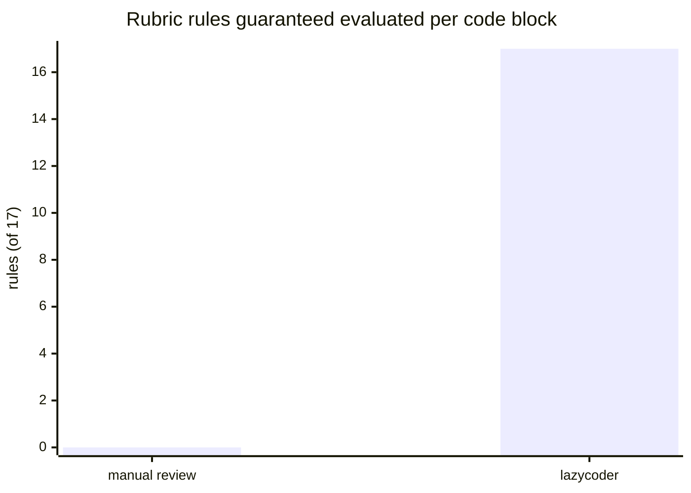
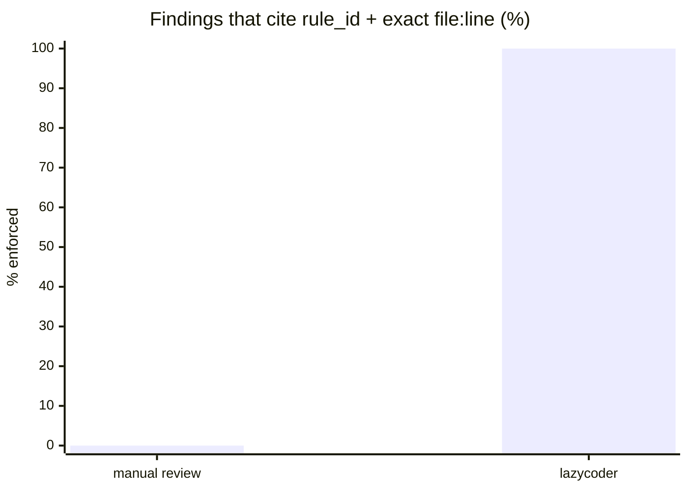

<h1>&nbsp;lazycoder</h1>

A code review agent with senior-level judgement. It interrogates every changed
block against a fixed rubric, runs the real checks, and returns a defensible
verdict — **APPROVE / REQUEST_CHANGES / BLOCK** — before code is trusted or merged.

Code gets written fast. The bottleneck is trusting it. lazycoder is the reviewer
that never gets tired, never skips a rule, and never self-reports green without
running the checks.

## Install

```bash
export ANTHROPIC_API_KEY=sk-ant-...

uvx lazycoder my.diff              # zero-install run
pipx install lazycoder             # or install the CLI permanently

git diff main | uvx lazycoder -    # review your branch straight from a pipe
```

Exit codes map the verdict — `0` APPROVE, `1` REQUEST_CHANGES, `2` BLOCK — so it
drops into CI as a gate with no glue code. `--json` emits the full report.

## Manual review vs lazycoder

| | Manual review | lazycoder |
|---|---|---|
| **Coverage** | Whatever the reviewer remembers to look at | Every rule (R1–R17) evaluated, every time |
| **Consistency** | Varies by reviewer, mood, time of day | Same rubric, same policy, deterministic |
| **Verdict** | "LGTM" / gut feel | APPROVE / REQUEST_CHANGES / BLOCK from a severity policy |
| **Evidence** | Comments, sometimes | Every finding cites `rule_id` + exact file:line |
| **Green claims** | "tests pass" (trust me) | Real linter/typecheck/test output in a sandbox |
| **Untrusted code** | Reviewer may run it locally | Reviewed code is data, never executed outside the sandbox |
| **Speed at scale** | Slows down as diffs grow | Loops the rubric per block, unattended |
| **Auditability** | Lives in someone's head | Append-only decision log; any verdict is replayable |

lazycoder does not replace the human — a person still confirms consequential
decisions. It removes the parts humans are bad at: remembering all 17 rules,
staying consistent across 200 files, and proving the checks actually ran.

Two structural facts, at a glance. These are not benchmarks — they are
properties enforced by the schema, so they hold on every single review:



Manual review *may* cover all 17 — nothing guarantees it. lazycoder cannot emit
a verdict until every rule has a recorded pass/fail (`APPROVE` is refused
otherwise).



A human reviewer *can* cite evidence; the lazycoder domain model makes an
uncited finding unrepresentable — pydantic rejects it before it exists.

## Status

The **full pipeline is live end to end** — deterministic core plus the real
model. A unified diff flows all the way to an aggregated verdict:

```
diff → parse_diff → CodeBlock[]
         └─ review_rubric(block, rubric)  # every rule, every block
              └─ RuleResult[] → from_rule_results → aggregate → verdict
```

The same flow runs in two modes, sharing every line of plumbing:

- **Fake client** (default, CI): deterministic, network-free. `pytest -q` proves
  the parser, aggregator, and verdict policy on every run.
- **Real client** (opt-in): `AnthropicClient` hits the live API. The first live
  run of eval E3 already passed — the model caught the SQL injection, flagged
  R7, and the pipeline derived `BLOCK` with zero parse failures.

Because the model was the *last* thing plugged in, any failure isolates to the
prompt or the model — never to the plumbing, which is already proven. The
response parser is hardened against real LLM output (code fences, surrounding
prose, severity casing), and the reviewer prompt teaches the model the exact
`Finding` schema with a literal example, so form errors die at the source.

## Config-driven policy

Policy is declarative and lives in `config/`, not buried in code. Each file is
one part of the setup — reviewable, diffable, swappable:

```
lazycoder/
├── config/
│   ├── harness.json              # project context, stack, hard rules, definition of done
│   ├── guardrails.json           # what the agent may / may not do; injection defense; limits
│   ├── setup.json                # runtime, deps + rationale, env vars, bootstrap
│   ├── working_loop.json         # specify → plan → execute → verify → decide
│   ├── task_loop.json            # orchestrator + review subagents, isolation, aggregation
│   ├── review_rules.json         # R1..R17 — the interrogation rubric (the core)
│   ├── production_readiness.json # the release gate
│   ├── evals.json                # known-flawed/clean cases that test the reviewer
│   └── observability.json        # append-only decision log, tracing, redaction
├── src/argus/                    # domain, config loader, reviewers, llm client
└── tests/                        # unit + integration + eval coverage
```

## The rubric (R1..R17)

Code-level: data structure (R1), control flow (R2), inputs/outputs (R3), failure
modes (R4), side effects (R5), dependencies (R6). Security: validation, secrets,
injection (R7). Simplicity: simplest form (R8). System-level: state (R9), sync vs
async (R10), monolith vs services (R11), invariant (R12). Plus maintainability,
tests, and compatibility rules through R17.

## Design decisions — the *why*

The interesting part of this project is not the review logic; it's the choices
that make the review logic trustworthy.

- **Deterministic core, model last.** Everything that can be pure logic *is* pure
  logic, and the non-deterministic LLM is bolted on at the very end. This is a
  deliberate failure-isolation strategy: when a review goes wrong, the bug is in
  the prompt or the model, because the plumbing has tests proving it isn't there.

- **Contracts make invalid state unrepresentable.** The domain types are strict
  pydantic models with validators, not bags of fields. A *passed* rule cannot
  carry a finding; a *failed* one must. Every finding must cite its `rule_id` and
  an exact `file:line`. The verdict is a *computed* field over findings, never a
  value someone can set by hand. You cannot construct a lying `ReviewReport`.

- **Normalize at the boundary, keep the core strict.** Untrusted LLM text is
  cleaned up where it enters (`"HIGH"` → `"high"`), but the domain enum stays the
  single source of truth and never loosens. Leniency lives at the edge; the core
  does not bend.

- **Debt is executable, not documented.** The one known parser limitation is
  pinned by a `strict` xfail test, not a comment someone can ignore. The day the
  fix lands, that test flips to green and the suite *tells you* the debt is
  closed. Notes rot; tests don't.

- **TDD throughout.** Every behavior went RED before GREEN — including the
  garbage-input fixtures that hardened the parser.

- **The eval is the product.** `config/evals.json` is a set of known-flawed and
  known-clean cases whose job is to measure *the reviewer itself*. Wired as a CI
  gate, it closes the loop: a code reviewer that has its own reviewer, and knows
  whether it's still good every time it changes.

## Develop

```bash
uv sync --extra dev
pre-commit install

pytest -q                       # deterministic suite — no network, no key
ruff check . && black --check .
mypy src
```

To run the live-API suite (opt-in, never part of `pytest -q`):

```bash
cp .env.example .env            # fill in ANTHROPIC_API_KEY — .env is gitignored
set -a; source .env; set +a
pytest -m integration
```

## Roadmap

1. ~~Multi-file / diff orchestration on top of `review_rubric`.~~ ✓
2. ~~Harden the response parser against real LLM output (fixtures).~~ ✓
3. ~~Wire `config/evals.json` as a regression gate on the fake client — a missed
   rule fails the gate.~~ ✓
4. ~~Wire the real Anthropic client behind the same `LLMClient` protocol, with an
   opt-in integration suite (`pytest -m integration`). First live run: the model
   caught eval E3's SQL injection (R7 → BLOCK).~~ ✓
5. **Run the full evals.json set against the live model** and track the score
   over time — the eval stops measuring the plumbing and starts measuring the
   reviewer: does this prompt, on this model, still catch what it must?
6. ~~Distribution: published to [PyPI](https://pypi.org/project/lazycoder/) with
   a `lazycoder` console entry point (`uvx lazycoder my.diff`), rubric bundled
   in the wheel, releases via trusted publishing on `v*` tags.~~ ✓
7. **GitHub Action** wrapping the CLI, so `uses: aisona-lab/lazycoder` gates a
   PR with the same rubric and exit codes.
