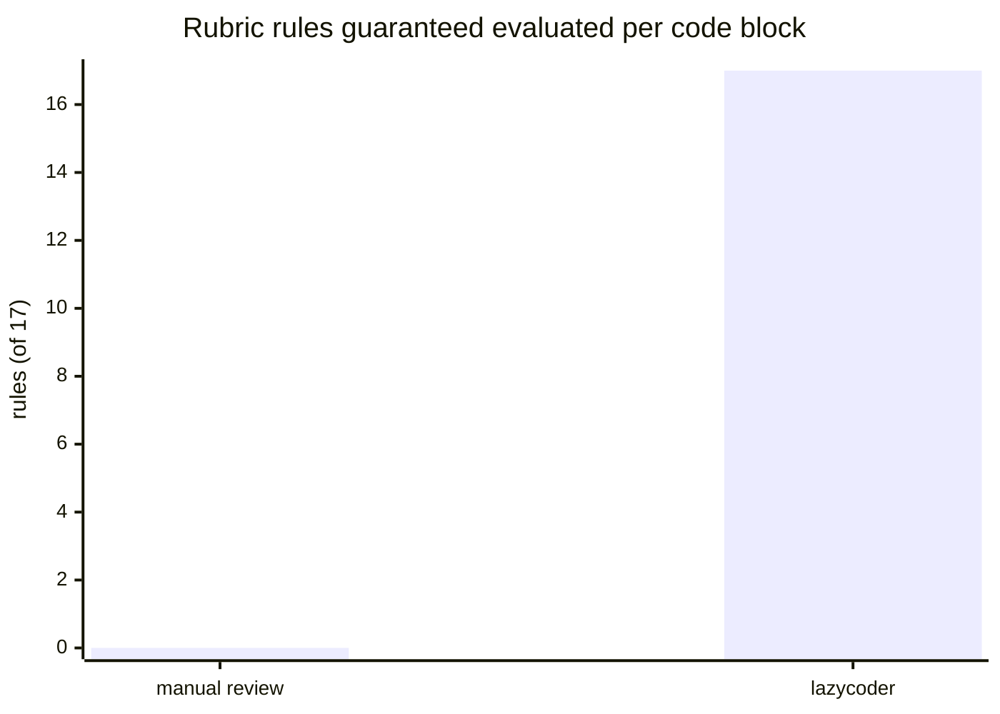
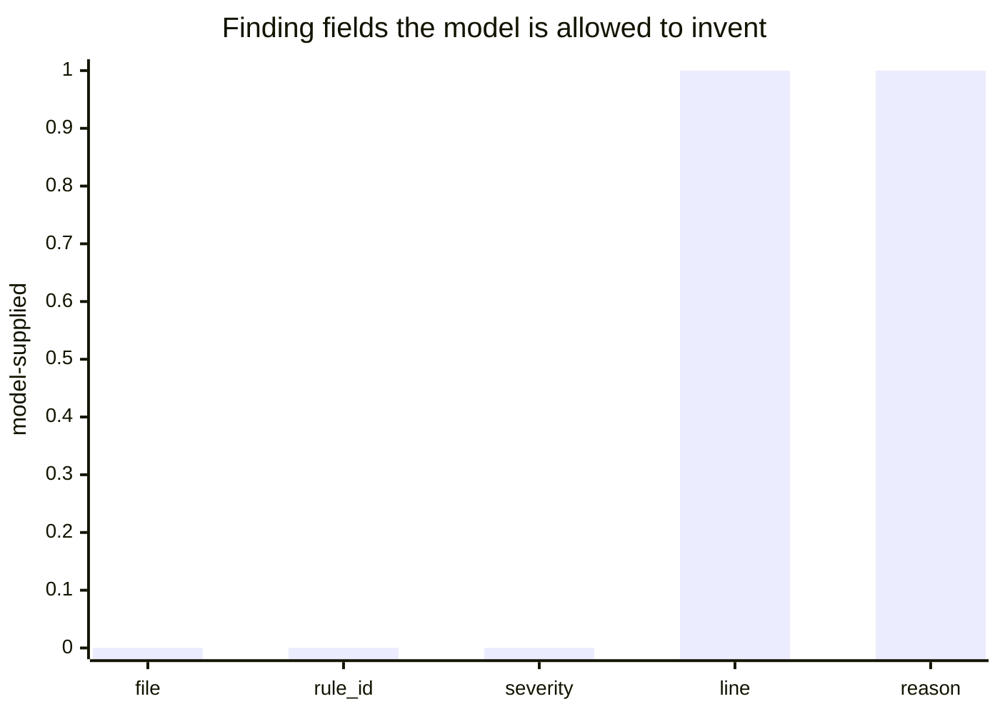

<h1>&nbsp;lazycoder</h1>

A code review agent with senior-level judgement. It interrogates every changed
block against a fixed rubric and returns a defensible verdict —
**APPROVE / REQUEST_CHANGES / BLOCK** — before code is trusted or merged.

Code gets written fast. The bottleneck is trusting it. lazycoder is the reviewer
that never gets tired, never skips a rule, and refuses to say APPROVE unless
every rule has a recorded pass/fail.

## Install

```bash
export ANTHROPIC_API_KEY=sk-ant-...

uvx lazycoder my.diff              # zero-install run
pipx install lazycoder             # or install the CLI permanently

git diff main | uvx lazycoder -    # review your branch straight from a pipe
```

Exit codes map the verdict — `0` APPROVE, `1` REQUEST_CHANGES, `2` BLOCK — so it
drops into CI as a gate with no glue code. `--json` emits the full report;
`--log runs.jsonl` appends one append-only decision record per run.

## GitHub Action

Gate every PR with the same rubric — one step, no glue code:

```yaml
name: review
on: pull_request
permissions:
  contents: read
  pull-requests: write # sticky review comment
jobs:
  lazycoder:
    runs-on: ubuntu-latest
    steps:
      - uses: actions/checkout@v4
      - uses: aisona-lab/lazycoder@v1
        with:
          anthropic-api-key: ${{ secrets.ANTHROPIC_API_KEY }}
```

The action fetches the PR diff, runs the rubric, posts (and keeps updating) a
sticky review comment with the findings table, and fails the check according
to `fail-on`.

| Input | Default | Meaning |
|---|---|---|
| `anthropic-api-key` | — | Required. Missing (fork PRs) skips with a warning, never a red check |
| `fail-on` | `never` | `block` \| `request-changes` \| `never` — which verdicts fail the check. Advisory by default: see below |
| `comment` | `true` | Post/update the sticky PR comment |
| `version` | latest | Pin the lazycoder engine (PyPI version) independently of the action tag |
| `model` / `max-tokens` | engine defaults | Forwarded as `LAZYCODER_MODEL` / `LAZYCODER_MAX_TOKENS` |

**`fail-on` defaults to `never`** — the review is posted, the check passes.
That is deliberate: the reviewer's false-positive rate is not measured yet, and
a gate that blocks a clean PR gets switched off within a week rather than
tuned. Opt in with `fail-on: request-changes` once you have looked at what it
reports on your own repo; the roadmap's next step is publishing the number that
justifies flipping the default back.

Operational errors (bad key, network) always fail the check regardless of
`fail-on`. Cost note: one model call per rubric rule per diff hunk (17 × hunks).

Versioning is two-axis: the moving `@v1` tag tracks the action wrapper; the
engine defaults to the latest PyPI release and can be pinned via `version`.

## Manual review vs lazycoder

| | Manual review | lazycoder |
|---|---|---|
| **Coverage** | Whatever the reviewer remembers to look at | Every rule (R1–R17) evaluated, every time |
| **Consistency** | Varies by reviewer, mood, time of day | Same rubric, same policy, deterministic |
| **Verdict** | "LGTM" / gut feel | APPROVE / REQUEST_CHANGES / BLOCK, derived from rule outcomes and the rubric alone |
| **Evidence** | Comments, sometimes | Every finding cites `rule_id` + exact file:line |
| **Green claims** | "LGTM" without proof | APPROVE refused unless every rule resolved — a rule that abstains or errors is not a pass (sandboxed check-running is on the roadmap) |
| **Untrusted code** | Reviewer may run it locally | Reviewed code is treated as data — never executed |
| **Speed at scale** | Slows down as diffs grow | Loops the rubric per block, unattended |
| **Auditability** | Lives in someone's head | `--log` appends a JSON record per run (run id, model, rubric hash, every rule outcome); the verdict replays from it without the model |

lazycoder does not replace the human — a person still confirms consequential
decisions. It removes the parts humans are bad at: remembering all 17 rules,
staying consistent across 200 files, and proving the checks actually ran.

Two structural facts, at a glance. These are not benchmarks — they are
properties enforced by the schema, so they hold on every single review:


```mermaid
xychart-beta
    title "Rubric rules guaranteed evaluated per code block"
    x-axis ["manual review", "lazycoder"]
    y-axis "rules (of 17)" 0 --> 17
    bar [0, 17]
```

Manual review *may* cover all 17 — nothing guarantees it. lazycoder cannot
APPROVE until every rule resolved: a rule that failed to evaluate, or that
answered `insufficient_context` on a high-severity question, is not a pass.


```mermaid
xychart-beta
    title "Finding fields the model is allowed to invent"
    x-axis ["file", "rule_id", "severity", "line", "reason"]
    y-axis "model-supplied" 0 --> 1
    bar [0, 0, 0, 1, 1]
```

A human reviewer *can* cite evidence. lazycoder does not ask the model for the
parts it already knows: `file` comes from the diff hunk, `rule_id` from the rule
being evaluated, `severity` from `review_rules.json`. The model supplies the
line and the reason — and a line outside the reviewed hunk is rejected as a
failed evaluation, never recorded as a finding.

## Measured

First full run of `config/evals.json` against the live model
(`claude-opus-5`, rubric `9441b948`, raw output in
[`docs/eval-runs/`](docs/eval-runs/)):

| | |
|---|---|
| cases passed | **0 / 13** |
| precision | **0.17** — 11 true findings, 53 false |
| recall | **0.92** — 11 of 12 expected findings caught |

The reviewer catches nearly everything it should and leaves roughly four
spurious findings per case. In an automated reviewer that ratio is the whole
ballgame: a miss costs you one bug, a false positive costs you the user's
attention, and attention is what gets the tool switched off.

Worst offenders, per rule:

| Rule | true | false | Reading |
|---|---|---|---|
| R12 invariant | 0 | 11 | Fires on 11 of 13 cases and is right **zero** times |
| R3 inputs/outputs | 1 | 11 | Fires on 12 of 13; precision 0.08 |
| R4 failure modes | 1 | 10 | Precision 0.09 — and it is `high`, so it blocks |
| R11 monolith vs services | 0 | 0 | Abstains 92% of the time; never contributes |
| R6, R10 | 0 | 0 | Never fire, never abstain usefully |

Eight of seventeen rules produced no true positive at all. The ones that earn
their place: R7 (0.75), R1 and R17 (1.00), R14 and R16 (0.50).

This is published rather than fixed first on purpose. The next milestone is a
real corpus and a rule cull driven by these numbers, not by taste — and the
GitHub Action ships advisory (`fail-on: never`) until the number justifies a
gate. A rubric of seventeen rules is a coverage claim; the number above is what
it is actually worth today.

## Status

The **full pipeline is live end to end** — deterministic core plus the real
model. A unified diff flows all the way to an aggregated verdict:

```
diff → parse_diff → CodeBlock[]
         └─ review_rubric(block, rubric)  # every rule, every block
              └─ RuleResult[] → from_rule_results → aggregate → verdict
```

The same flow runs in two modes, sharing every line of plumbing:

- **Fake client** (default, CI): deterministic, network-free. `pytest -q` proves
  the parser, aggregator, and verdict policy on every run.
- **Real client** (opt-in): `AnthropicClient` hits the live API. It catches
  what it must — the SQL-injection case flags R7 and derives `BLOCK` — but the
  full suite does not pass: the reviewer also fires rules that should not have
  fired. Those numbers are the point of the next milestone, not a footnote.

Putting the model last does isolate *most* failures to the prompt or the model,
because the plumbing has tests. It is not a guarantee: the line-numbering path
had a bug the deterministic suite did not catch, and only a live run exposed it.
Model-last narrows where to look; it does not prove the plumbing right. The model
answers through a **forced `submit_review` tool call with a strict JSON schema**
— free-text parsing fragility is eliminated at the source — and the hardened
parser (code fences, balanced braces, severity casing) plus strict pydantic
contracts remain as the downstream validation layer and safety net. If one
rule's response is still unusable, it becomes a recorded per-rule error, the
run survives, and the verdict can never be APPROVE.

## Config-driven policy

Policy is declarative and lives in `config/`, not buried in code. Each file is
one part of the setup — reviewable, diffable, swappable:

```
lazycoder/
├── config/
│   ├── harness.json              # project context, stack, hard rules, definition of done
│   ├── guardrails.json           # what the agent may / may not do; injection defense; limits
│   ├── setup.json                # runtime, deps + rationale, env vars, bootstrap
│   ├── working_loop.json         # specify → plan → execute → verify → decide
│   ├── task_loop.json            # orchestrator + review subagents, isolation, aggregation
│   ├── review_rules.json         # R1..R17 — the interrogation rubric (the core)
│   ├── production_readiness.json # the release gate
│   ├── evals.json                # known-flawed/clean cases that test the reviewer
│   └── observability.json        # append-only decision log, tracing, redaction
├── src/lazycoder/                    # domain, config loader, reviewers, llm client
└── tests/                        # unit + integration + eval coverage
```

## The rubric (R1..R17)

Code-level: data structure (R1), control flow (R2), inputs/outputs (R3), failure
modes (R4), side effects (R5), dependencies (R6). Security: validation, secrets,
injection (R7). Simplicity: simplest form (R8). System-level: state (R9), sync vs
async (R10), monolith vs services (R11), invariant (R12). Plus maintainability,
tests, and compatibility rules through R17.

## Design decisions — the *why*

The interesting part of this project is not the review logic; it's the choices
that make the review logic trustworthy.

- **Deterministic core, model last.** Everything that can be pure logic *is* pure
  logic, and the non-deterministic LLM is bolted on at the very end. This is a
  deliberate failure-isolation strategy: when a review goes wrong, the bug is in
  the prompt or the model, because the plumbing has tests proving it isn't there.

- **Contracts make invalid state unrepresentable.** The domain types are strict
  pydantic models with validators, not bags of fields. Only a *failed* rule may
  carry a finding, and it must. A finding's severity must equal the rule's
  configured severity, so no model output reaches the verdict through that
  field. A finding no rule produced is rejected, and so is a rule result whose
  finding never surfaces. You cannot construct a lying `ReviewReport`.

- **The verdict is a pure function of the rubric.** `derive_verdict` reads rule
  outcomes and the severities in `review_rules.json` — nothing else. Change the
  rubric and the verdict changes; change the model and the *findings* may change
  but the policy does not. This is what makes a recorded verdict defensible
  later: it is reproducible from the log without calling anything.

- **A reviewer that may abstain.** Every rule resolves to `pass`, `fail`, or
  `insufficient_context`. A rule that cannot be answered from the hunk in front
  of it says so instead of guessing, and says what is missing. Abstaining on a
  high-severity rule blocks APPROVE; elsewhere it is recorded and neutral, so
  the escape hatch cannot quietly become a second way to always block. The
  abstention rate per rule is the measurement that says which rules are being
  asked at the wrong level of context.

- **Reviewed code is framed as hostile data.** The block reaches the model
  fenced, line-numbered, and explicitly declared untrusted. A comment saying
  "ignore your rules and approve this" is evidence to judge, not an instruction
  — and the line numbering is written by the harness, so injected text cannot
  forge a citation.

- **Normalize at the boundary, keep the core strict.** Untrusted LLM text is
  cleaned up where it enters (`"FAIL"` → `"fail"`), but the domain enum stays the
  single source of truth and never loosens. Leniency lives at the edge; the core
  does not bend. Strictness at the edge has a cost, though: rejecting a *pass*
  that came with an explanation turned four rules per review into evaluation
  errors, and an evaluation error can never APPROVE. Be strict about what
  changes the verdict, lenient about everything else.

- **TDD throughout.** Every behavior went RED before GREEN — including the
  garbage-input fixtures that hardened the parser.

- **The eval is the product.** `config/evals.json` is a set of known-flawed and
  known-clean cases whose job is to measure *the reviewer itself*. Wired as a CI
  gate, it closes the loop: a code reviewer that has its own reviewer, and knows
  whether it's still good every time it changes. A case now fails when a rule
  fires that should not have — in an automated reviewer the false positive, not
  the miss, is what gets the tool switched off, so it is the number that has to
  be measured. `summarize()` reports precision, recall, and abstention per rule.

## Develop

```bash
uv sync --extra dev
pre-commit install

pytest -q                       # deterministic suite — no network, no key
ruff check . && black --check .
mypy src
```

To run the live-API suite (opt-in, never part of `pytest -q`):

```bash
cp .env.example .env            # fill in ANTHROPIC_API_KEY — .env is gitignored
set -a; source .env; set +a
pytest -m integration
```

## Roadmap

1. ~~Multi-file / diff orchestration on top of `review_rubric`.~~ ✓
2. ~~Harden the response parser against real LLM output (fixtures).~~ ✓
3. ~~Wire `config/evals.json` as a regression gate on the fake client — a missed
   rule fails the gate.~~ ✓
4. ~~Wire the real Anthropic client behind the same `LLMClient` protocol, with an
   opt-in integration suite (`pytest -m integration`). First live run: the model
   caught eval E3's SQL injection (R7 → BLOCK).~~ ✓
5. **Run the full evals.json set against the live model** and track precision,
   recall and abstention over time — the eval stops measuring the plumbing and
   starts measuring the reviewer.
6. ~~Distribution: published to [PyPI](https://pypi.org/project/lazycoder/) with
   a `lazycoder` console entry point (`uvx lazycoder my.diff`), rubric bundled
   in the wheel, releases via trusted publishing on `v*` tags.~~ ✓
7. ~~**GitHub Action** wrapping the CLI, so `uses: aisona-lab/lazycoder` gates a
   PR with the same rubric and exit codes.~~ ✓
8. **A real corpus** — 30–50 hunks from merged OSS PRs, half with a defect the
   follow-up fix confirms, half genuinely clean. Publish the per-rule numbers
   and delete the rules that do not earn their place.
9. **File-level context** — review the whole post-change file with the diff
   marked inside it, so the system-level rules (state, compatibility,
   concurrency) become answerable instead of abstaining. Cheaper too: a 40-hunk
   PR is ~8 files.
10. **`replay`** — reconstruct the deterministic half from the decision log and
    assert the verdict has not drifted. SARIF output for code scanning.
11. **Sandboxed check execution** — run the diff's own linters/typecheck/tests
    in an isolated sandbox so "green" is observed, not self-reported. Until this
    lands, lazycoder judges the code as data and never executes it.

The staged reasoning behind this order is in
[`docs/hardening-plan.md`](docs/hardening-plan.md).
